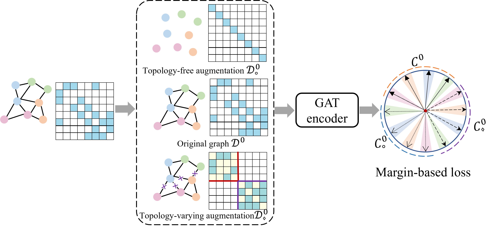
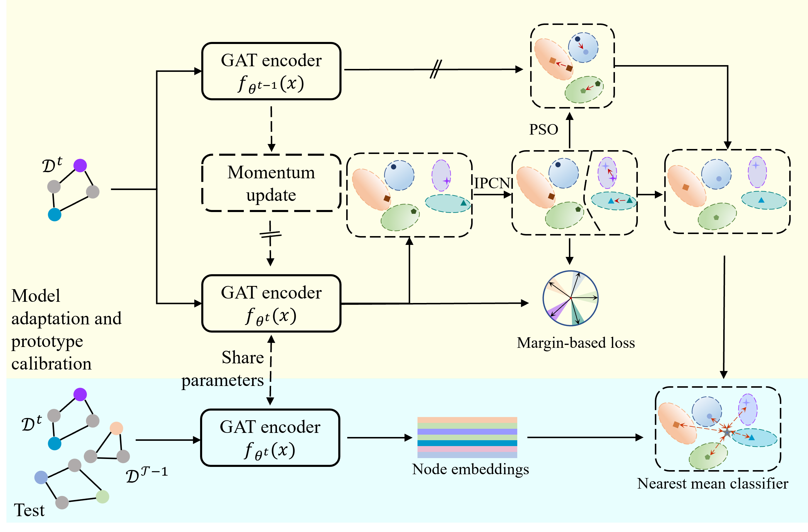

## TAP： Inductive Graph Few-shot Class Incremental Learning

The official repository of [**Inductive Graph Few-shot Class Incremental Learning**](https://arxiv.org/pdf/2411.06634)

This work addresses the inductive graph few-shot class-incremental learning problem. It proposes a topology-based class 
augmentation and prototype calibration approach to enhance model generalization and mitigate catastrophic forgetting.

[//]: # (![Alt text]&#40;frame.png&#41;)
[//]: # (![Alt text]&#40;'figures/framework.png' "Optional title"&#41;)

<figure>
  
<figcaption>
</figcaption>
</figure>
<figure>
  
  <figcaption>
</figcaption>
</figure>

## Usage 

<!-- ```plaintext -->
Setup conda environment and install required packages.
```python
# Create environment
conda create -n tap python=3.10 -y
conda activate tap

# Install requirements
conda install pytorch==1.13.1 torchvision==0.14.1 torchaudio==0.13.1 pytorch-cuda=11.6 -c pytorch -c nvidia

# Clone TAP repo
git clone https://github.com/csiro-robotics/TAP.git
cd TAP

# Install other requirements
pip install -r requirements.txt
```
<!-- ``` -->


## Running the Experiments

```python
python main.py --dataset Amazon_clothing  --way 5 --shot 5 --kmean_hops 5 --seed 2
python main.py --dataset cora_full --way 5 --shot 5 --kmean_hops 5 --seed 2
python main.py --dataset dblp  --way 10 --shot 5 --kmean_hops 3 --seed 2
```

### Citation
```
@article{li2024inductive,
  title={Inductive graph few-shot class incremental learning},
  author={Li, Yayong and Moghadam, Peyman and Peng, Can and Ye, Nan and Koniusz, Piotr},
  journal={Proceedings of the Eighteenth ACM International Conference on Web Search and Data Mining},
  year={2024}
}
```

### Acknowledgments
This work was partially funded by
CSIRO’s Reinvent Science and CSIRO’s Data61 Science Digital. 
Additionally, This work was partially supported by the Analytics for the Australian Grains Industry (AAGI) Strategic Partnership with funding allocated by the Grains Research Development Corporation
(GRDC UOQ2301-010OPX ) and by The University of Queensland (DVCR2201A). 
